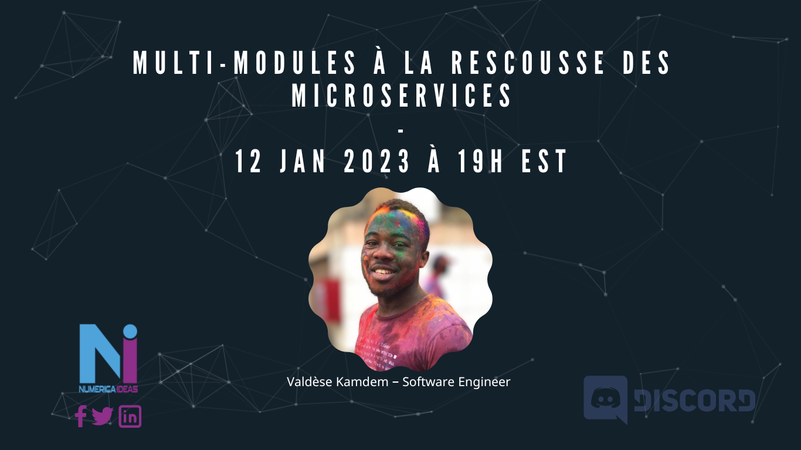

# NumericaIdeas Meetup

**Type**: Local - Québec, Canada.

**Date**: On the 12th, January 2023.

**Speaker**: Valdèse Kamdem

**Topic**: Multi-modules à la rescousse des microservices.

**Slides**: [presentation.pdf](./presentation.pdf)

**Video**: https://youtu.be/e_LJvcikUCk

**Source code**: https://github.com/numerica-ideas/advanced-multi-modules-architecture-meetup

**Summary**: Think of your application like you are doing microservices without paying the full price of microservices architectures, this **advanced multi-modules architecture** should be considered as an intermediate solution to remain on a monolithic base App that can quickly progress to become a microservices infrastructure whenever needed, the idea behind is *we don't need microservices, or at least not now, even better, not when we write the first lines of code of the App*.
