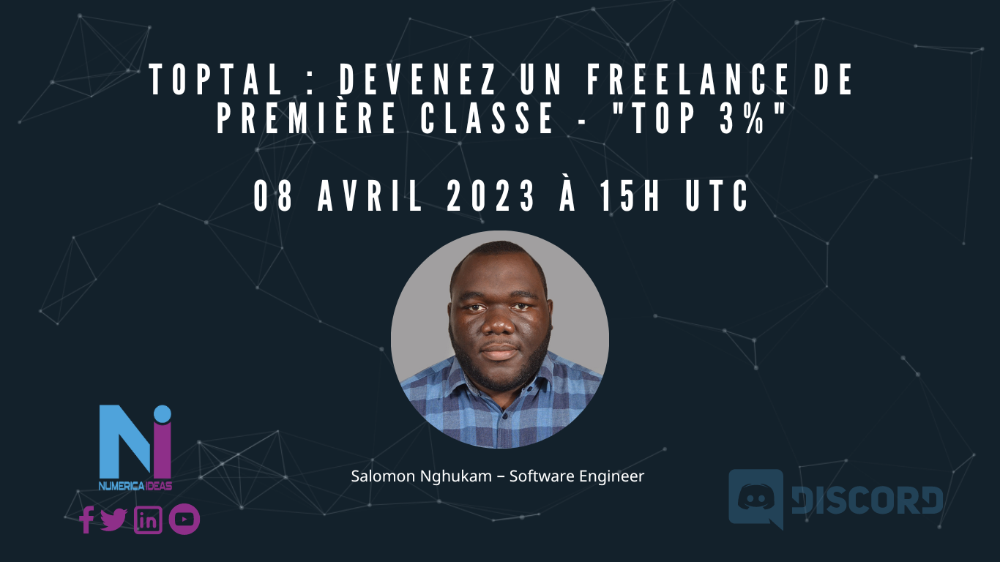

# Ni Meetup#02 

**Type**: Cameroun / France / Québec, Canada

**Date**: Le 08, Avril 2023 à 15h UTC.

**Topic**: Devenez un freelance de première classe (3%) avec Toptal.

**Language**: Français (FR)

**Speaker**: [Salomon Nghukam](https://www.linkedin.com/in/salomon-nghukam)

**Organizer**: [Orleando Dassi](https://www.linkedin.com/in/dassi-orleando-257b04ab)

**Slides**: [presentation.pdf](./presentation.pdf)

**Replay**: https://youtu.be/AmhMAQTxcGg

**Summary**: Vous êtes un développeur, designer ou expert dans votre domaine, cherchant à rejoindre une communauté de freelancers d'élite? Alors cette video est faite pour vous apprendre comment rejoindre le réseau de talents le plus convoité - **Toptal**. Le speaker partage son expérience à travers les étapes pour devenir un membre de ce réseau sélectif et vous donne des conseils pratiques pour vous aider à réussir en tant que freelance de première classe.

:warning: Cliquez [ici](https://www.youtube.com/@numericaideas/channels?sub_confirmation=1) pour vous abonner à nos **chaînes YouTube (En & Fr)** pour être notifié des prochaines vidéos.
